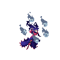

# Open Duelyst Assets

This repository pulls out the 2D image assets from [OpenDuelyst][1] for ease of
use. The `plist` files containing the frame information have been converted into
`json`.

The Python script used to generate the repository can be found in
[scripts/extract_assets.py][2]. The files are copied from the [app/resources][3]
directory which contains the compressed assets. The original assets can be found
under [app/original_resources][4].

## Example

| Animation | GIF                                      |
|-----------|------------------------------------------|
| Attack    |        |
| Breathing |  |
| Death     |          |
| Hit       |              |
| Idle      |            |
| Run       |              |

## Frames

```json
{
  "texture_filename": "boss_andromeda.png",
  "width": 1024,
  "height": 1024,
  "frames": {
    "attack": [
      {
        "frame_name": "boss_andromeda_attack_000.png",
        "x0": 303,
        "y0": 101,
        "x1": 403,
        "y1": 201,
        "width": 100,
        "height": 100
      },
      // ...
    ],
    "idle": [
      // ...
    ],
    // ...
  }
}
```

## Spritesheet


## TODO

- [ ] Dedupe similar animation types (e.g. "cast" vs "casting" vs "castloop").

[1]: https://github.com/open-duelyst/duelyst
[2]: scripts/extract_assets.py
[3]: https://github.com/open-duelyst/duelyst/tree/c3e506565048b8a724b699f8816b84ba8433f711/app/resources
[4]: https://github.com/open-duelyst/duelyst/tree/c3e506565048b8a724b699f8816b84ba8433f711/app/original_resources
